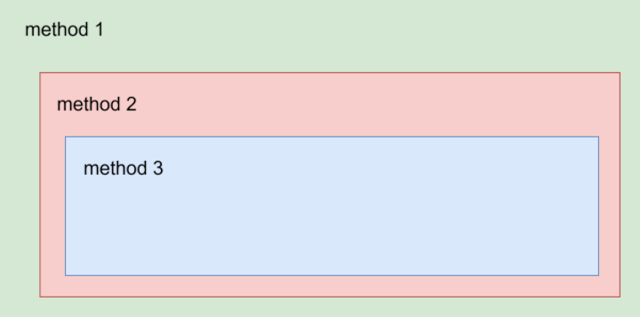

# SQL 路由

SQL路由是 `SQLX` 框架中的一个核心功能，它允许您根据特定的规则将SQL语句路由到不同的数据源或集群。通过灵活的路由配置，您可以优化数据库访问，提高应用程序的性能和可扩展性。


## SQL路由配置方式

在`application.yml`或`application.properties`中配置SQL路由规则。以下是一个示例配置：

```yaml
sqlx:
  enabled: true
  pointcuts:
    - expression: "execution(* com.example.service.UserService.getUserById(..))"
      cluster: userCluster
      nodes:
        - read_0
        - read_1
      propagation: true
```

## SQL路由注解方式

您还可以使用 `com.github.sqlx.annotation.SqlRouting` 注解的方式来配置SQL路由规则。
注解方式和配置方式是等价的,注解方式会对您的代码带来侵入性,我们更建议您使用配置方式。 以下是一个注解方式示例：

```java
package com.example.service;

import lombok.extern.slf4j.Slf4j;
import io.github.sqlx.annotation.SqlRouting;
import org.springframework.jdbc.core.JdbcTemplate;
import org.springframework.stereotype.Service;
import org.springframework.beans.factory.annotation.Autowired;

@Service
@Slf4j
public class UserService {

    @Autowired
    private JdbcTemplate jdbcTemplate;

    /**
     * This method retrieves a user by ID and uses the @SqlRouting annotation
     * to specify that the SQL operation should be routed to a specific cluster
     * and nodes.
     */
    @SqlRouting(cluster = "userCluster", nodes = {"read_0", "read_1"}, propagation = true)
    public Map<String, Object> getUserById(Long userId) {
        String sql = "SELECT * FROM users WHERE id = ?";
        Map<String, Object> user = jdbcTemplate.queryForMap(sql, userId);
        log.info("User: {}", user);
        return user;
    }

    /**
     * This method updates a user's information and specifies a different routing
     * configuration using the @SqlRouting annotation.
     */
    @SqlRouting(cluster = "userCluster", nodes = {"write_0"}, propagation = false)
    public void updateUser(Long userId, String newName) {
        String sql = "UPDATE users SET name = ? WHERE id = ?";
        int rowsAffected = jdbcTemplate.update(sql, newName, userId);
        log.info("Rows affected: {}", rowsAffected);
    }
}
```

## 事务场景

`sqlx` 兼容 `spring` 事务管理,会自动检测是否存在事务，如果一个方法为事务方法，则该方法内的所有SQL都会被路由到同一个可写数据源，使用同一个 `Connection` 对象。

以下是一个使用 `@Transactional` 注解来处理事务场景的示例。在这个示例中，`sqlx` 会自动检测事务，并确保事务内的所有 SQL 操作被路由到同一个可写数据源。

```java
package com.example.service;

import io.github.sqlx.annotation.SqlRouting;
import org.springframework.jdbc.core.JdbcTemplate;
import org.springframework.stereotype.Service;
import org.springframework.beans.factory.annotation.Autowired;
import org.springframework.transaction.annotation.Transactional;
import lombok.extern.slf4j.Slf4j;

@Service
@Slf4j
public class UserService {

    @Autowired
    private JdbcTemplate jdbcTemplate;

    /**
     * This method performs a series of database operations within a transaction.
     * All SQL operations will be routed to the same writable data source.
     */
    @Transactional
    @SqlRouting(cluster = "userCluster", nodes = {"write_0"})
    public void performTransactionalOperations(Long userId, String newName) {
        // Retrieve user information
        String selectSql = "SELECT * FROM users WHERE id = ?";
        Map<String, Object> user = jdbcTemplate.queryForMap(selectSql, userId);
        log.info("User before update: {}", user);

        // Update user information
        String updateSql = "UPDATE users SET name = ? WHERE id = ?";
        int rowsAffected = jdbcTemplate.update(updateSql, newName, userId);
        log.info("Rows affected by update: {}", rowsAffected);

        // Insert a new log entry
        String insertSql = "INSERT INTO user_logs (user_id, action) VALUES (?, ?)";
        jdbcTemplate.update(insertSql, userId, "Updated user name to " + newName);

        // Retrieve updated user information
        user = jdbcTemplate.queryForMap(selectSql, userId);
        log.info("User after update: {}", user);
    }
}
```

### 事务传播

当使用了 `spring` 事务的传播特性时,需要同时正确设置 `sqlx` 的路由传播保持和 `spring` 的事务传播一致。

```java
package com.example.service;

import io.github.sqlx.annotation.SqlRouting;
import org.springframework.jdbc.core.JdbcTemplate;
import org.springframework.stereotype.Service;
import org.springframework.beans.factory.annotation.Autowired;
import org.springframework.transaction.annotation.Propagation;
import org.springframework.transaction.annotation.Transactional;
import lombok.extern.slf4j.Slf4j;

@Service
@Slf4j
public class UserService {

    @Autowired
    private JdbcTemplate jdbcTemplate;

    @Autowired
    private LogService logService;

    /**
     * This method starts a transaction and calls another method with a different
     * transaction propagation setting.
     */
    @Transactional(propagation = Propagation.REQUIRED)
    @SqlRouting(cluster = "cluster_0", nodes = {"write_0"})
    public void updateUserAndLog(Long userId, String newName) {
        // Update user information
        String updateSql = "UPDATE users SET name = ? WHERE id = ?";
        int rowsAffected = jdbcTemplate.update(updateSql, newName, userId);
        log.info("Rows affected by update: {}", rowsAffected);

        // Call another method with a different transaction propagation setting
        logService.logUserUpdate(userId, newName);

        String selectSql = "SELECT * FROM users WHERE id = ?";
        user = jdbcTemplate.queryForMap(selectSql, userId);
        log.info("User after update: {}", user);
    }
}

@Service
@Slf4j
class LogService {

    @Autowired
    private JdbcTemplate jdbcTemplate;

    /**
     * This method logs the user update action with a REQUIRES_NEW propagation setting,
     * meaning it will run in a new transaction.
     */
    @Transactional(propagation = Propagation.REQUIRES_NEW)
    @SqlRouting(cluster = "cluster_0", nodes = {"write_1"}, propagation = false)
    public void logUserUpdate(Long userId, String action) {
        String insertSql = "INSERT INTO user_logs (user_id, action) VALUES (?, ?)";
        jdbcTemplate.update(insertSql, userId, "Updated user name to " + action);
        log.info("Logged user update for userId: {}", userId);
    }
}
```

在这个示例中 `updateUserAndLog` 方法中的 SQL `UPDATE users SET name = ? WHERE id = ?` , `SELECT * FROM users WHERE id = ?` 都会被路由到 `cluster_0` 集群的 `write_0` 节点，而 `logService.logUserUpdate` 方法中的 SQL 都会被路由到 `cluster_0` 的 `write_1` 节点。

## 嵌套调用

`sqlx` 支持嵌套调用，嵌套调用时方法内的 SQL 会被路由到该方法指定的集群和节点执行,这取决于该方法是否允许外层方法的路由传播到该方法.
是否允许传播由用户根据自身业务需求控制.

**注意** 
- `propagation` 默认为 `true`,如果需要禁止传播需要设置 `propagation` 为 `false`.
- 嵌套调用时需要使用代理对象进行调用,否则 SQL 路由无法起作用.




```java
package com.example.service;

import io.github.sqlx.annotation.SqlRouting;
import org.springframework.jdbc.core.JdbcTemplate;
import org.springframework.stereotype.Service;
import org.springframework.beans.factory.annotation.Autowired;
import lombok.extern.slf4j.Slf4j;

@Service
@Slf4j
public class UserService {

    @Autowired
    private JdbcTemplate jdbcTemplate;

    @Autowired
    private LogService logService;

    /**
     * This method updates user information and logs the update.
     * The SQL operations in this method will be routed to the specified cluster and nodes.
     */
    @SqlRouting(cluster = "cluster_0", nodes = {"write_0"}, propagation = true)
    public void updateUser(Long userId, String newName) {
        // Update user information
        String updateSql = "UPDATE users SET name = ? WHERE id = ?";
        int rowsAffected = jdbcTemplate.update(updateSql, newName, userId);
        log.info("Rows affected by update: {}", rowsAffected);

        // Log the user update
        logService.logUserUpdate(userId, newName);
    }
}

@Service
@Slf4j
class LogService {

    @Autowired
    private JdbcTemplate jdbcTemplate;

    @Autowired
    private NotificationService notificationService;

    /**
     * This method logs the user update action and sends a notification.
     * The SQL operations in this method will be routed to the specified cluster and nodes.
     */
    @SqlRouting(cluster = "cluster_0", nodes = {"write_1"}, propagation = true)
    public void logUserUpdate(Long userId, String action) {
        String insertSql = "INSERT INTO user_logs (user_id, action) VALUES (?, ?)";
        jdbcTemplate.update(insertSql, userId, "Updated user name to " + action);
        log.info("Logged user update for userId: {}", userId);

        // Send notification
        notificationService.sendNotification(userId, "Your account do action:" + action);
    }
}

@Service
@Slf4j
class NotificationService {

    @Autowired
    private JdbcTemplate jdbcTemplate;

    /**
     * This method sends a notification to the user.
     * The SQL operations in this method will be routed to the specified cluster and nodes.
     */
    @SqlRouting(cluster = "cluster_1", nodes = {"write_0"}, propagation = false)
    public void sendNotification(Long userId, String message) {
        String insertSql = "INSERT INTO notifications (user_id, message) VALUES (?, ?)";
        jdbcTemplate.update(insertSql, userId, message);
        log.info("Notification sent to userId: {}", userId);
    }
}
```

## 注解 SQL

`sqlx` 支持使用注解的方式来指定 SQL 路由信息，以下是两个使用注解 SQL 的示例，展示了如何在 SQL 语句中嵌入注解来指定路由信息。这种方式可以在不修改代码逻辑的情况下，灵活地控制 SQL 的路由。

### 指定数据源名称

sql 被路由到名称为 `read_0` 的节点执行. 

注意注解 SQL 不能在事务方法中使用,注解 SQL 适合的场景是单一的数据库访问场景,比如从多个不同的库当中聚合数据。

```sql
/*!nodeName=read_0;*/ SELECT * FROM users WHERE id = 1;
```

## SQL 函数执行器

`SQLX` 提供了一个 `SqlExecutor` 工具类，来执行 SQL 函数并返回结果。考虑到您可能使用一些无需手动编写 SQL 的 ORM 框架如 JPA.
通过 SQL 函数的方式也可以达到和 SQL 注解方式一样的效果。

```java
Employee result = SqlExecutor.execute(() -> employeeRepository.findById(1L), "write_0");
```


## 路由组 & 路由规则

`RouteGroup` 是一个路由组，路由组内包含多个路由规则，路由规则用于匹配数据源。
您可以自定义 `RouteGroup` 路由组和 `RouteRule` 路由规则来实现自定义的 SQL 路由逻辑.


`SQLX` 提供了一个默认路由规则:

- SingleDatasourceRouteRule : 单数据源路由规则
- TransactionRouteRule : 事务路由规则
- ForceTargetRouteRule : 强制指定目标数据源路由规则
- RoutingNameSqlHintRouteRule : 节点名称 SQL 注解路由规则
- ReadWriteSplittingRouteRule : 读写分离路由规则
- NullSqlAttributeRouteRule : 空 SQL 属性路由规则
- DefaultDataSourceRouteRule ： 默认数据源路由规则
- RouteWritableRule : 路由到可读节点路由规则

具体您可以参考 `ClusterRouteGroupBuilder` 和 `NoneClusterRouteGroupBuilder`.

**注意** 自定义路由规则时需要注意规则的执行顺序，如果规则执行顺序有冲突，可能会导致路由结果错误。

