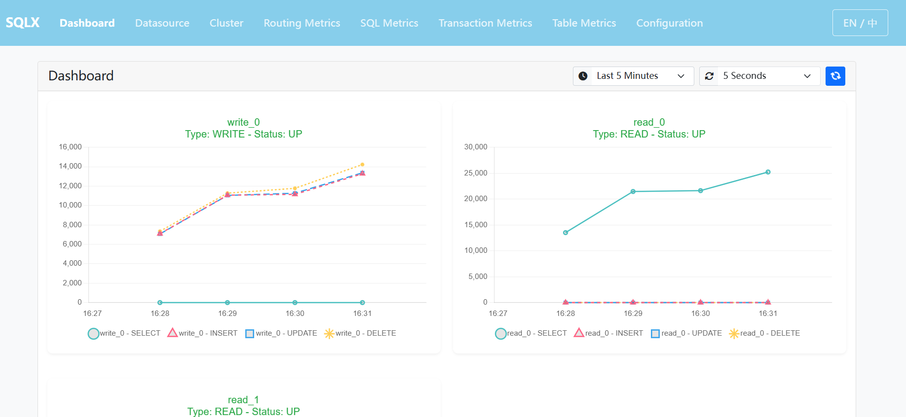

# 监控 & 管理


`SQLX` 提供了监控和管理功能，帮助您实时跟踪和分析数据库操作的性能和状态。通过监控界面，您可以查看数据源的状态、SQL 路由情况、SQL 执行情况、事务性能等。




## web 容器支持

`SQLX` 提供了内嵌页面,同时支持 `Servlet` 和 `Spring WebFlux`. 
`spring boot` 应用启动时指定 `WebApplicationType`.

**Servlet 容器**

```java
@SpringBootApplication
public class ServletApplication {

    public static void main(String[] args) {
        new SpringApplicationBuilder(ServletApplication.class)
                .web(WebApplicationType.SERVLET)
                .run(args);
    }
}
```

*****Spring WebFlux**

```java
@SpringBootApplication
public class ReactiveApplication {

    public static void main(String[] args) {
        new SpringApplicationBuilder(ReactiveApplication.class)
                .web(WebApplicationType.REACTIVE)
                .run(args);
    }
}
```


## 监控功能概览

- **Dashboard**: 提供数据源的整体状态视图，包括每个数据源的类型和当前状态。
- **Datasource**: 显示所有配置的数据源的详细信息。
- **Cluster**: 查看集群的配置和状态。
- **Routing Metrics**: 跟踪 SQL 路由的性能指标。
- **SQL Metrics**: 分析 SQL 语句的执行情况。
- **Transaction Metrics**: 监控事务的执行性能。
- **Table Metrics**: 查看表级别的操作统计。
- **Configuration**: 显示当前的 `SQLX` 配置信息。

## 管理功能概述

- **新增数据源**: 添加新的数据源。
- **改变数据源权重&状态**: 更改数据源的权重和状态。
- **删除数据源**: 删除数据源。
- **管理集群中的节点**: 增加、删除集群中的节点。

### 注意

**数据源状态**
- **UP**: 数据源可用。
- **DOWN**: 数据源不可用。
- **OUT_OF_SERVICE**: 节点被排除在提供服务节点之外。
- **UNKNOWN**: 数据源状态未知。

如果您需要移除某个数据源，我们建议您先将数据源状态设置为 `OUT_OF_SERVICE` 同时观察 `Dashboard` 页面确认不在有流量进入该数据源后再移除。

