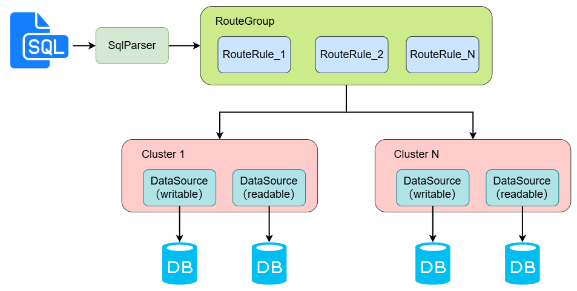

# 简介

`SQLX` 是对 JDBC 的扩展，主要功能是对多数据源的支持。
它提供了一种更灵活、高效的方式来管理和操作多个数据库连接，简化了系统中对数据库访问的路由和切换逻辑。

sqlx 以轻量级、零侵入的方式实现,在实现用户需求的同时不对用户代码进行任何侵入,避免用户项目与某一种技术深度绑定。
方便用户使用，减少开发和替换成本。

## 工作原理

- SQL 语句解析
- `RouteGroup` 路由组中的 `RouteRule` 路由规则决定 SQL 语句路由到那个数据源进行执行

## 如何参与
- 如果您在使用 sqlx 过程中，发现 bug 或者有新的述求，欢迎提交 issue ，请按标准模板进行填写，以便我们快速进行定位和理解，从而解决问题或者精确实现您的诉求
- 如果您希望参与到代码开发中来，欢迎提交 pull request(如何使用 [pull request](https://help.github.com/articles/using-pull-requests))
- 如果 sqlx 帮助到了您的业务，并且觉得这个产品还不错，请多多向您的朋友、同事推荐，感谢

## 交流渠道

- 可发送邮件到[dawn.hexingmo@gmail.com](mailto:dawn.hexingmo@gmail.com)
- 添加管理员拉群

